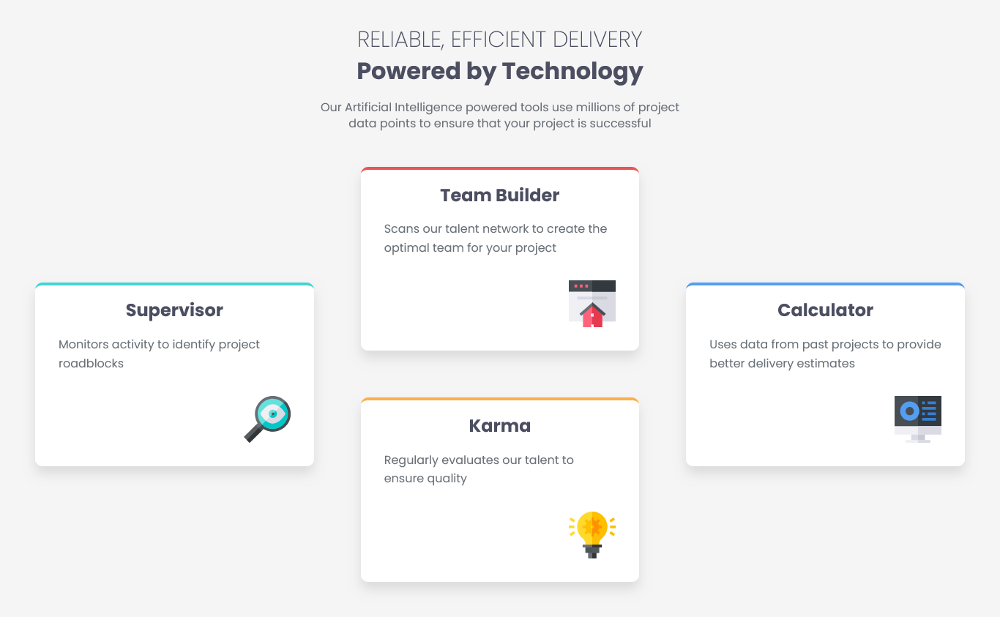

# Four card feature section 

## Table of contents

- [Overview](#overview)
  - [Screenshot](#screenshot)
  - [Links](#links)
  - [Built with](#built-with)
  - [Useful resources](#useful-resources)
- [Author](#author)

## Overview

### Screenshot

### Links

- Solution URL: [Add solution URL here](https://your-solution-url.com)
- Live Site URL: [Add live site URL here](https://your-live-site-url.com)

### Built with

- Semantic HTML5 markup
- CSS custom properties
- Flexbox
- CSS Grid

### Useful resources

- [MDN Docs](https://developer.mozilla.org/en-US/) - I really liked this pattern and will use it going forward.
- [CSS Tricks](https://css-tricks.com/) 

## Author

- Frontend Mentor - [@shaheerahmedkhan11](https://www.frontendmentor.io/profile/shaheerahmedkhan11)

